# envlock

[](https://github.com/BenDavies1218/envlock/actions/workflows/ci.yml)
[](https://github.com/BenDavies1218/envlock/actions/workflows/typecheck.yml)

Inject secrets from 1Password into your app at runtime using [dotenvx](https://dotenvx.com) encrypted env files.

No secrets ever touch your shell history, CI environment variables, or unencrypted `.env` files.

## Packages

| Package                           | Version                                                                                         | Description                                 |
| --------------------------------- | ----------------------------------------------------------------------------------------------- | ------------------------------------------- |
| [`envlock-next`](./packages/next) | [](https://www.npmjs.com/package/envlock-next) | Next.js plugin and `envlock` CLI            |
| [`envlock-core`](./packages/core) | [](https://www.npmjs.com/package/envlock-core) | Framework-agnostic CLI and shared utilities |

Use `envlock-next` for Next.js projects. Use `envlock-core` directly for any other Node.js project.

## How it works



## Security model

envlock injects secrets in two phases so they never appear in shell history, CI environment variables, or unencrypted files:

1. **`op run` phase** — envlock re-invokes itself wrapped inside `op run --environment <id>`. The 1Password CLI resolves your secrets and injects `DOTENV_PRIVATE_KEY_<ENV>` into the child process environment, then hands control back.
2. **`dotenvx` phase** — the re-invoked process detects `DOTENV_PRIVATE_KEY_<ENV>` already set, skips `op run`, and calls the `dotenvx` JS API in-process to decrypt the encrypted `.env.*` file. The target command is then spawned with secrets in its environment.

In CI, set `DOTENV_PRIVATE_KEY_<ENV>` directly (e.g. from a vault secret). envlock detects it and skips the `op run` phase entirely.

## envlock-next

### Installation

```bash
npm install envlock-next
```

On install, `envlock-next` automatically rewrites your `package.json` scripts:

```json
{ "dev": "envlock dev", "build": "envlock build", "start": "envlock start" }
```

### Setup

Add `withEnvlock` to your `next.config.js` (or `next.config.ts`):

```ts
import { withEnvlock } from "envlock-next";

export default withEnvlock(nextConfig, {
  onePasswordEnvId: "your-1password-env-id",
});
```

Or set the `ENVLOCK_OP_ENV_ID` environment variable instead in a root level .env.

### Usage

```bash
envlock dev          # next dev with .env.development secrets
envlock build        # next build with .env.production secrets
envlock start        # next start with .env.production secrets
envlock run <cmd>    # run any command with secrets injected
```

**Environment flags:**

```bash
envlock dev --staging      # use .env.staging
envlock build --production # use .env.production (default for build)
```

**Auto port switching:**

If the default port (3000) is in use, `envlock dev` automatically finds the next free port and logs a notice:

```
[envlock] Warning: Port 3000 in use, switching to 3001
```

**Debug output:**

```bash
envlock dev --debug
```

---

## envlock-core

### Installing envlock-core

```bash
npm install envlock-core
```

### CLI usage

```bash
# Run any command with secrets injected
envlock node server.js
envlock python app.py --port 4000

# Named commands from envlock.config.js
envlock dev
envlock start --production

# Explicit run subcommand (bypasses config)
envlock run node migrate.js
```

**Config file** (`envlock.config.js`):

```js
export default {
  onePasswordEnvId: "your-1password-env-id",
  commands: {
    dev: "node server.js --watch",
    start: "node server.js",
  },
};
```

### Programmatic API

```ts
import { findFreePort, runWithSecrets, log } from "envlock-core";

// Find a free port starting from preferred
const port = await findFreePort(3000); // returns 3000, or 3001 if taken, etc.

// Run a command with secrets injected
runWithSecrets({
  envFile: ".env.development",
  environment: "development",
  onePasswordEnvId: "your-env-id",
  command: "node",
  args: ["server.js"],
});
```

---

## Contributing

**Prerequisites:** Node 18+, pnpm 9+

```bash
# Install dependencies
pnpm install

# Build all packages (core first, then next)
pnpm build

# Run all tests
pnpm test
```

Packages are in `packages/`. Each has its own `tsup` build and `vitest` test suite.

> **Note for contributors:** `envlock-next` bundles `envlock-core` into its CLI binary via `noExternal`. Always build core before next (`pnpm build` handles this with `--workspace-concurrency=1`).

## License

MIT — [Benjamin Davies](https://github.com/BenDavies1218)
